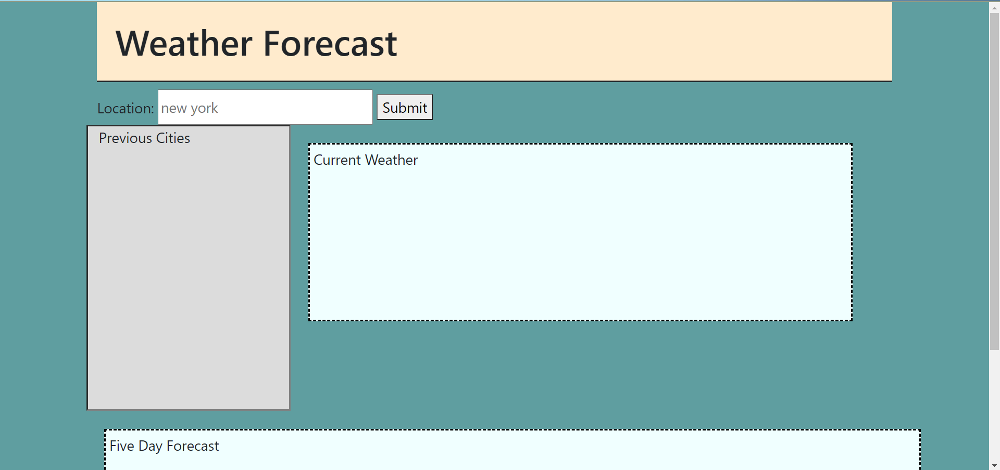
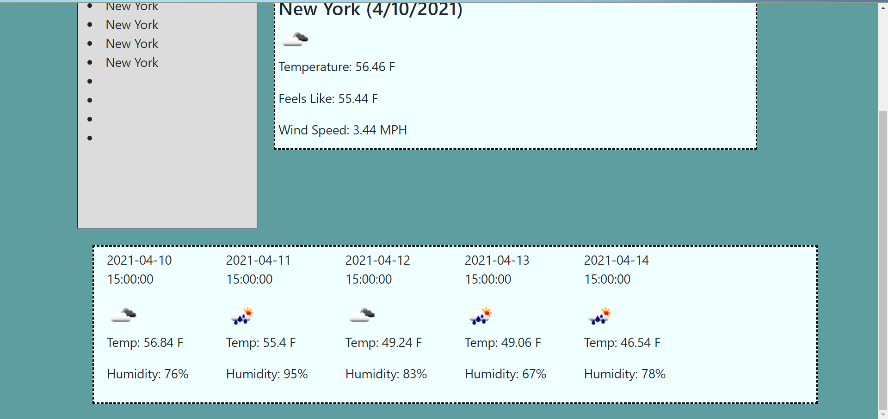

# week6weather

When user pulls up the website they are greeted with a search bar and three boxes.  
When the user types a city name into the search bar and hits search, the current weather for the city is displayed in the top box, previous searches are displayed in the previous cities box, and the five day forecast and dates are displayed in the bottom box.  
If a city is clicked in the previous searches box, the results for that city will appear in the boxes.  

I was unable to find the UV Index option with the results arrays.  I replaced this with Feels Like.  

The URL for this webpage is: https://desantel.github.io/week6weather/
